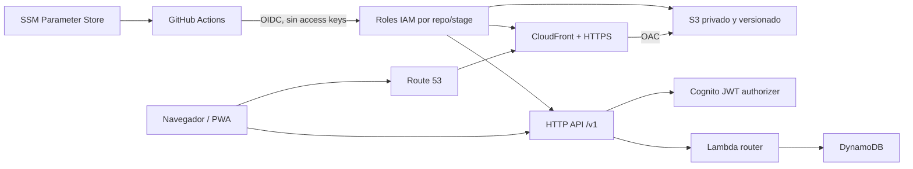

# Arquitectura AWS

## Objetivo y límites

Este repositorio concentra toda la infraestructura AWS de RoadMap2U y permite reproducirla por ambiente. La aplicación web continúa en su repositorio propio, pero su hosting, dominio, parámetros de runtime y roles de despliegue se modelan aquí.

Esta entrega es deliberadamente **no operativa sobre la cuenta**: crea código, pruebas, documentación y workflows. No hace bootstrap, deploy, invalidaciones ni cambios DNS.

## Vista general

La petición al API usa una URL base sin `/v1`; el cliente agrega esa versión al construir cada ruta. Las rutas de Angular que no corresponden a un objeto se reescriben a `index.html` en el borde, sin hacer público el bucket.

## Modelo de stages

`stage` es obligatorio y admite únicamente `dev`, `test` o `prod`. Cada recurso con nombre físico, stack y parámetro incorpora ese valor. No se comparte User Pool, tabla, API, bucket ni distribución entre ambientes.

| Propiedad | `dev` | `test` | `prod` |
|---|---|---|---|
| Frontend | `dev.roadmap2u.com` | `test.roadmap2u.com` | `roadmap2u.com` |
| API | `api.dev.roadmap2u.com` | `api.test.roadmap2u.com` | `api.roadmap2u.com` |
| CORS localhost | sí: 4200 y 8826 | sí: 4200 y 8826 | no |
| Retención al borrar stack | eliminable | eliminable | `RETAIN` |
| DynamoDB PITR / protección | según configuración no productiva | según configuración no productiva | habilitada |
| S3 versioning | habilitado | habilitado | habilitado |
| DNS frontend gestionado | sí | sí | **no inicialmente** |

Producción crea el certificado y la distribución previstos para apex/`www`, pero no crea ni actualiza sus aliases al principio. Esto evita sustituir de manera lateral el sitio que ya atiende esos nombres.

## Backend por stage

### Identidad

Cognito usa `username` como único alias de inicio de sesión. El email es un atributo opcional/verificable, no un alias de login. El app client web no tiene secret y utiliza SRP. El trigger post-confirmation reserva el username en DynamoDB mediante una escritura condicional para que dos confirmaciones concurrentes no puedan reclamar el mismo nombre.

Los atributos y la política de contraseña proceden del contrato vendorizado. Las cuentas de menores las crea exclusivamente el backend; el frontend nunca recibe permisos administrativos sobre Cognito.

### API y cómputo

HTTP API expone las rutas bajo `/v1`, con dominio propio por stage. El authorizer valida tokens Cognito antes de invocar el router Lambda. La función vuelve a resolver el perfil y las relaciones en DynamoDB: un claim no reemplaza una comprobación de autorización.

El router implementa las superficies de perfil, familia, amistades, visitas de bosques y sincronización. CORS es una allowlist cerrada por ambiente. Producción no admite localhost.

### Datos

Una tabla DynamoDB por stage usa single-table design, pago por solicitud, TTL y dos índices secundarios. Producción activa point-in-time recovery y conserva la tabla al eliminar el stack. Los registros sincronizables son `trees`, `nodes`, `checkins`, `sessions`, `harvests` y `preserves`; preferencias locales sin `rev` no se sincronizan.

La ley de resolución es LWW por `rev` y luego `updatedAt`. El backend rechaza un `schemaVersion` superior a `SCHEMA_VERSION`, conserva tombstones y trata empates exactos como victoria de la copia almacenada.

## Hosting web por stage

- Bucket S3 privado, bloqueo de acceso público y versioning.
- CloudFront accede al origen únicamente mediante OAC; no se usa website hosting de S3.
- TLS obligatorio, compresión, `index.html` como raíz y reescritura de rutas SPA.
- Headers base de seguridad servidos por CloudFront.
- Certificado ACM en `us-east-1`, región requerida por CloudFront.
- `www.roadmap2u.com` deberá responder con redirección permanente al apex una vez realizado el cutover.

El despliegue del frontend publica primero assets con hash y caché `immutable`, después punteros PWA sin caché, y `index.html` al final. S3 Versioning y la conservación de los manifiestos actual/anterior permiten republicar un SHA conocido.

## DNS

Los aliases `dev`, `test`, `api.dev`, `api.test` y el dominio del API productivo se modelan por ambiente según corresponda. El stack inicial **no administra** los registros de frontend productivo:

- A de `roadmap2u.com`: `162.241.62.201`;
- CNAME de `www.roadmap2u.com`: `roadmap2u.com`.

El cutover es una operación futura, separada y reversible; véase [runbooks/dns-cutover.md](runbooks/dns-cutover.md).

## Parámetros de integración

Cada despliegue publica valores no secretos en Parameter Store:

| Ruta | Contenido |
|---|---|
| `/roadmap2u/{stage}/region` | región AWS |
| `/roadmap2u/{stage}/user-pool-id` | ID del User Pool |
| `/roadmap2u/{stage}/user-pool-client-id` | ID del cliente web |
| `/roadmap2u/{stage}/api-base-url` | URL base sin `/v1` |
| `/roadmap2u/{stage}/frontend-bucket` | nombre del bucket privado |
| `/roadmap2u/{stage}/cloudfront-distribution-id` | ID de la distribución |
| `/roadmap2u/{stage}/frontend-url` | URL pública del frontend |
| `/roadmap2u/{stage}/contract-hash` | SHA-256 conjunto de los contratos |

El frontend lee estos parámetros durante el workflow, valida que estén completos, rechaza una URL con `/v1` y exige que el hash sea idéntico al calculado desde su contrato fuente. Ningún valor se obtiene en runtime desde el navegador.

El proceso de publicación registra además marcadores operativos:

- `/roadmap2u/{stage}/frontend-releases/{sha}`: evidencia de que ese SHA terminó correctamente en el stage;
- `/roadmap2u/{stage}/frontend-release-sha`: SHA que se considera activo.

Estos marcadores no son configuración de la PWA. Sirven para exigir promociones del mismo SHA y seleccionar un rollback conocido; nunca deben escribirse antes de terminar publicación, invalidación y smokes.

## Identidad de CI/CD

GitHub Actions solicita un token OIDC de vida corta y asume un rol IAM específico para repositorio y GitHub Environment. Backend y frontend no comparten rol; `dev`, `test` y `prod` usan roles, toolkits y assets separados. En una sola cuenta, el límite efectivo entre stages depende de las policies de sus `CloudFormationExecutionRole`; revisarlas es un gate obligatorio antes de activar deploy. Dos roles adicionales separan el futuro cutover DNS: `roadmap2u-prod-dns-plan`, de solo lectura y restringido al environment `prod`, prepara evidencia; `roadmap2u-prod-dns-cutover`, restringido a `prod-dns-cutover`, es el único que puede mutar los aliases tras la segunda aprobación. Ninguno es asumido por el deploy ordinario. La política de confianza restringe al owner/repositorio esperado y al environment correspondiente.

Los roles de despliegue no son secretos. Sus ARNs, el account ID y `HOSTED_ZONE_ID` son variables del GitHub Environment. No se usan access key ID ni secret access key permanentes.

## Ciclo de vida y guardas

- Pull request: checkout de ambos repositorios como hermanos, instalación reproducible, paridad byte a byte, typecheck, Vitest y synth de los tres stages.
- `main`: solo puede desplegar `dev` cuando `AWS_DEPLOY_ENABLED=true`.
- Promoción: `test` recibe un SHA exitoso de `dev`; `prod` recibe el mismo SHA exitoso de `test` y requiere aprobación.
- Cada despliegue ejecuta diff, deploy, validación de outputs/SSM y smoke tests.
- Ningún deploy ordinario modifica el DNS apex/`www` de producción.

## Riesgos que siguen siendo gates de go-live

La infraestructura no convierte en cerrados los siguientes pendientes de producto/operación: atomicidad de invitaciones y límites bajo concurrencia, mayor entropía de contraseñas temporales, purga de cuentas adultas, salida de correo con SES y observabilidad/alertas operativas. También deben estar creadas y revisadas las policies de ejecución CloudFormation por stage. Deben resolverse o aceptarse explícitamente antes del go-live.
