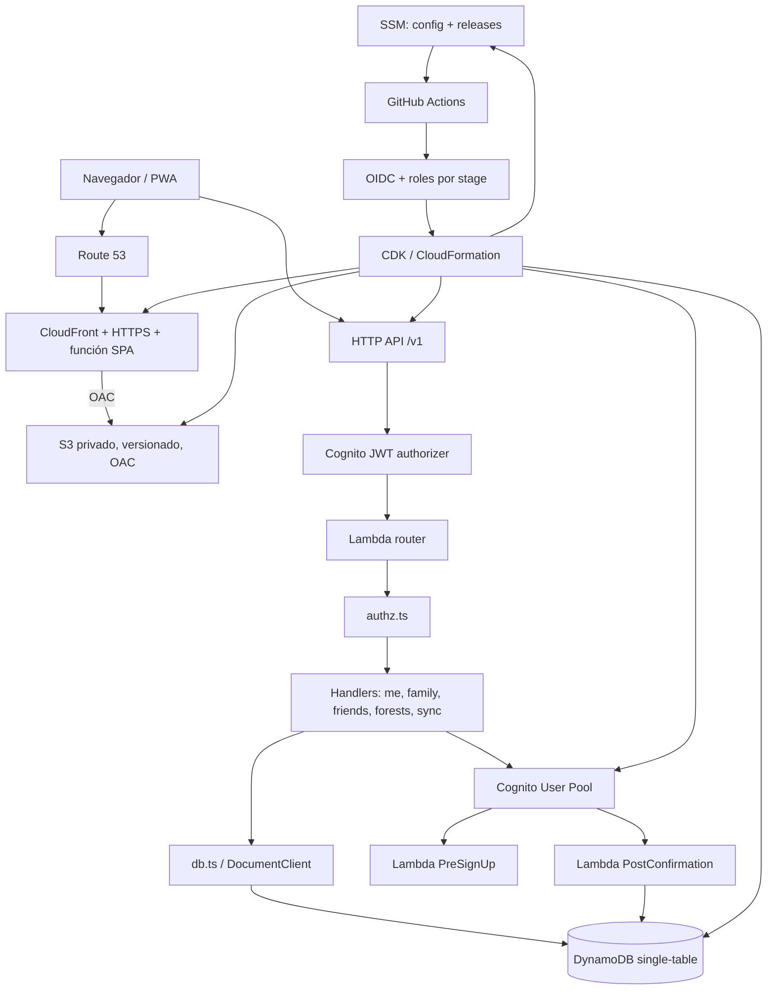
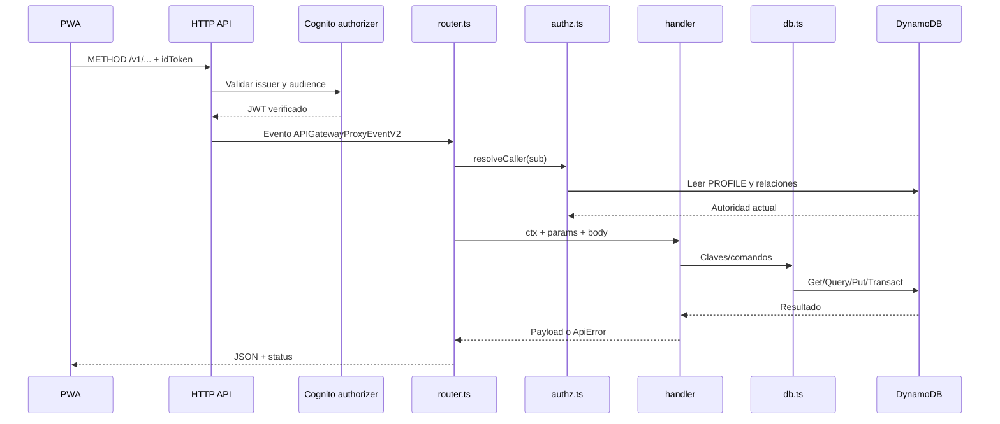

# Arquitectura

## 1. Estilo arquitectónico

La arquitectura principal es **serverless orientada a eventos sobre AWS**, con
una separación interna por capas:

```text
contratos -> adaptador de entrada -> autorización/casos de uso -> persistencia
```

El mismo repositorio contiene tres planos distintos:

1. **Runtime:** Cognito, API Gateway, tres Lambdas y DynamoDB.
2. **Entrega web:** Route 53, ACM, CloudFront y S3 privado.
3. **Control/operaciones:** CDK, IAM, SSM, GitHub Actions OIDC y runbooks.

Las restricciones que más moldean el diseño son el aislamiento `dev/test/prod`,
la privacidad familiar, el funcionamiento local-first y el mínimo privilegio
en una sola cuenta AWS.

## 2. Vista general



Cada stage obtiene instancias separadas de User Pool, tabla, API, Lambdas,
bucket, distribución y parámetros. Producción añade retención, protección de
borrado y termination protection.

## 3. Flujo de una petición API



Detalles importantes:

- `OPTIONS` sale antes de resolver JWT para permitir preflight.
- Las rutas de aplicación sí llevan authorizer.
- `sub` identifica al caller, pero `resolveCaller` vuelve a leer el perfil.
- Los parámetros de path sobrescriben query params.
- `ApiError` se convierte a una envoltura HTTP estable; errores inesperados
  devuelven mensaje genérico.

## 4. Responsabilidades por módulo

| Módulo | Posee | No posee | Evidencia |
|--------|-------|----------|-----------|
| `shared/` | Contrato normativo y schema | Dependencias AWS | `shared/api/contracts.ts` |
| `router.ts` | Matching método/path y adaptación HTTP | Reglas familiares | `lambda/router.ts` |
| `authz.ts` | Matriz de relaciones/autorización | Mutaciones de negocio | `lambda/authz.ts` |
| `handlers/` | Casos de uso | Creación de recursos AWS | `lambda/handlers/*.ts` |
| `db.ts` | Claves single-table y comandos | Presentación/HTTP | `lambda/db.ts` |
| `RoadmapStack` | Identidad, API, compute y datos | Hosting web | `lib/roadmap-stack.ts` |
| `RoadmapHostingStack` | S3, CloudFront, ACM y DNS frontend | Dominio API | `lib/roadmap-stack.ts` |
| `RoadmapCiBootstrapStack` | OIDC roles y control plane | Requests runtime | `lib/roadmap-stack.ts` |
| `stage-policies.ts` | Policies/boundaries por stage | Flujo de deploy | `lib/stage-policies.ts` |
| Workflows | Validación, promoción y operación | Lógica de dominio | `.github/workflows/*.yml` |

## 5. Persistencia y sincronización

DynamoDB usa single-table design:

```text
USER#id / PROFILE
USER#minor / GUARDIAN#guardian
USER#user / FRIEND#other
USER#recipient / FREQ#request
CODE#F#code o CODE#G#code / CODE
USER#owner / REC#store#id
UNIQ#USERNAME#name / UNIQ
```

- `gsi1` invierte guardianes/menores y requests entrantes/salientes.
- `gsi2` implementa un change feed por hora de recepción del servidor.
- TTL expira códigos, solicitudes y rate buckets.
- El push acepta hasta 100 registros.
- La resolución es LWW: mayor `rev`, luego mayor `updatedAt`; empate exacto
  conserva el servidor.
- Tombstones se sincronizan como registros ordinarios.
- Preferencias `settings` permanecen sólo en el dispositivo.

## 6. Patrones reutilizados

| Patrón | Dónde | Motivo |
|--------|-------|--------|
| Dependency injection | `Deps` y parámetros `injected` | Tests sin AWS real y reloj congelado |
| Table-driven router | `ROUTES` | Paridad verificable con `API_PATHS` |
| Key builder/repository delgado | `K`, `getItem`, `queryPrefix` | Centralizar single-table design |
| Handler por feature | `lambda/handlers/` | Separar casos de uso |
| Transacción/conditional write | familia, amigos, sync | Concurrencia y unicidad |
| Contract vendoring + hash | `shared/`, scripts, CI, SSM | Compatibilidad frontend/backend |
| Stage factory | helpers y props CDK | Misma topología con aislamiento |
| Least privilege por tier | `stage-policies.ts` | Limitar CloudFormation y runtime |
| Release inmutable | workflow deploy + SSM | Promover/rollback por SHA probado |
| Plan/apply separado | workflow DNS | Revisar y revertir cambios críticos |

## 7. Arranque y despliegue

`bin/roadmap.ts` valida contexto y crea:

1. `Roadmap-{stage}-Backend`.
2. `Roadmap-{stage}-Hosting`.
3. `Roadmap-CiBootstrap`.

El control plane es bootstrapless y los workloads usan un qualifier distinto
por stage. CI sólo sintetiza. El workflow de deploy obtiene credenciales
temporales OIDC, valida un SHA exacto, exige prueba del stage anterior, ejecuta
diff/deploy, verifica ocho parámetros, CORS, TLS y logs, y finalmente publica
el manifiesto y los marcadores de release.

El DNS frontend productivo queda fuera del deploy ordinario. Su workflow crea
un plan inmutable con checksums, espera una segunda aprobación y aplica
exactamente el batch revisado.

## 8. Riesgos arquitectónicos

- `lib/roadmap-stack.ts` y `lib/stage-policies.ts` concentran demasiadas
  responsabilidades y son los principales hotspots de mantenimiento.
- Algunas lecturas de perfiles son N+1 y el push sync escribe secuencialmente.
- La atomicidad completa de invitaciones/límites concurrentes sigue declarada
  como gate de go-live.
- No hay métricas, alarmas o tracing de aplicación; sólo logs y smokes.
- `queryPrefix` no recorre `LastEvaluatedKey`; exports y purgas grandes pueden
  quedarse en la primera página de DynamoDB.
- El borrado de un menor usa `BatchWrite` sin reintentar `UnprocessedItems`.
- La operación smoke MFA tiene una limitación IAM documentada: las guardas por
  username/sub viven en el script, no en una condición AWS.

## 9. Evidencia

- `README.md`
- `docs/architecture.md`
- `docs/backend-contract.md`
- `bin/roadmap.ts`
- `lambda/router.ts`
- `lambda/authz.ts`
- `lambda/db.ts`
- `lambda/handlers/`
- `lib/roadmap-stack.ts`
- `lib/stage-policies.ts`
- `.github/workflows/deploy.yml`
- `.github/workflows/dns-cutover.yml`
